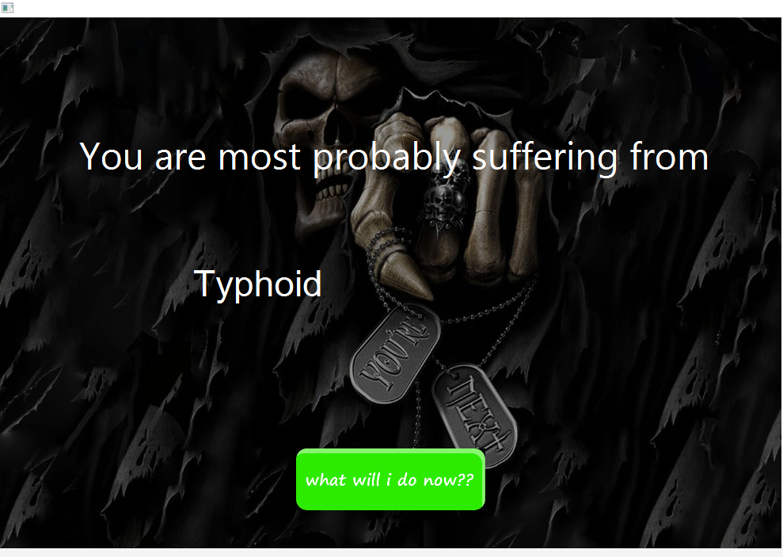
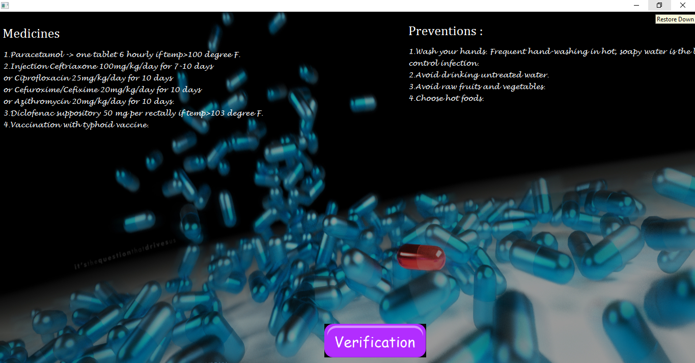
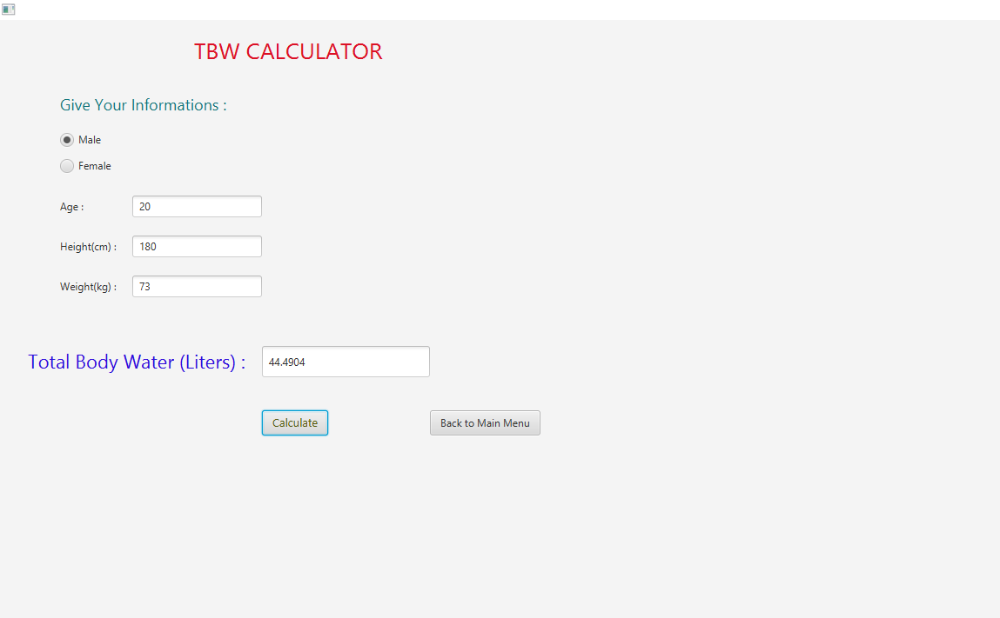

# Medical-Assistant

## Table of contents

* [Introduction](#introduction)

* [Features](#features)

* [Technologies](#technologies)

* [Demo Screenshots](#demo-screenshots)

* [Setup](#setup)

## Introduction

This is a java application that may help a user to find his/her diseases after giving the disease symptoms as input. This application/tool also provides medicines and preventive measures for the users. TBW (Total Body Water) and LBW (Lean Body Weight) of a person could also be known by using two different calculators which are also added in this application/tool.This was a group project built for an undergraduate academic course.

## Features

  * Provide an interface where the user can select the symptom/symptoms which he/she is suffering from
  
  * The application will tell the name of the disease based on the information received.
  
  * It will suggest some medicines/therapy helping the user cure himself/herself
  
  * It will also suggest some precautions which can help to prevent the disease
  
  * So far the application can identify 49 distinct disease
  
  * There are 173 distinct symptoms given to the users to select from
  
  ## Technologies
  * Java
  * JavaFX
  * XAMPP
  * HTML
  * MySQL
  * Scene builder
  
  ## Demo Screenshots
  

 
 
 style=“margin-top: 50px;”

 

 

 
 
style=“margin-top: 50px;”

 

 

 
 
 
 

 

 

 
 

 

 

 
 
 
 

 

 

 
 

 

 

 

 
 

 

 

 
 

 

 

 ## Setup
 
'Medical_Assistant.java' file should be built at first using any Java supported IDE. During building if some libraries are missing then 
'MEDICAL ASSISTANT\APACHE LANG3 LIBRARY\commons-lang3-3.6\commons-lang3-3.6.jar' file should be imported. XAMPP server should be setup locally.Then using 'phpMyAdmin' a 
database named 'medical_assistant' should be created from there the 'REQUIRED SQL TABLE\medical_assistant (1).sql' file should be imported. Now the project is ready to run.
